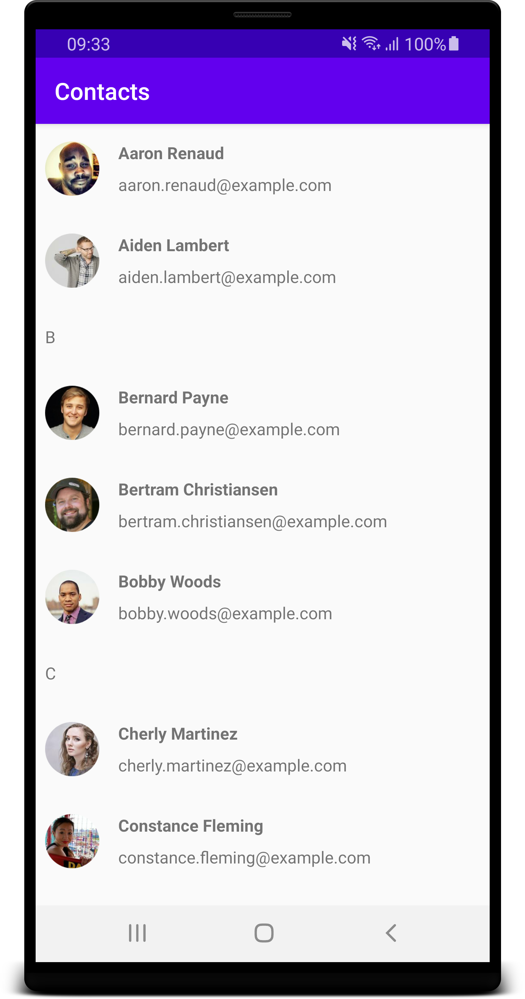
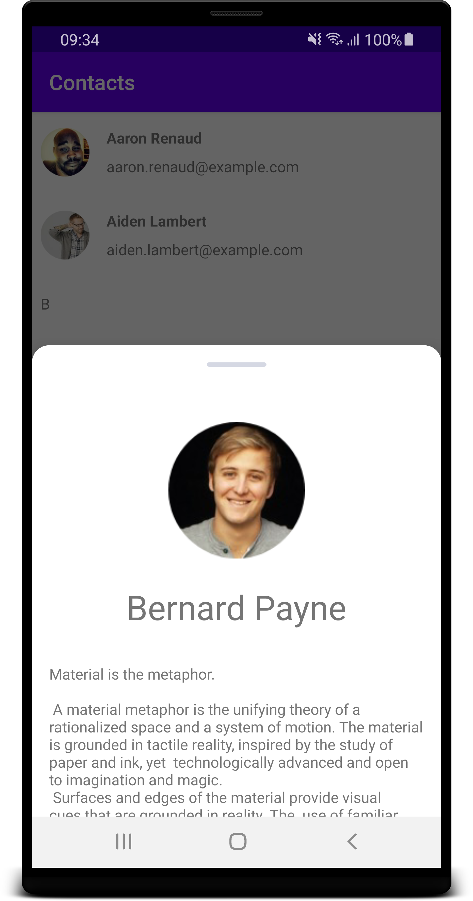

# ContactsApp

Kotlin Android application that connects to `https://randomuser.me/` and displays the result grouped by letters and sorted in alphabetical order.
  
## UI 

The app composits of two screens: 
  - Main Screen that displays list of all users
  - Details Screen that displays simple user details + (for now) some long stub text.

## Techincal remarks 
- The app is written with MVVM architecutre. 
- UI State is persisted across confuguration changes with Android `ViewModel`
- UI State is propagated from `ViewModel` to Ui with `LiveData`
- Api data is propagated to the `ViewModel` woith `RxJava`
- [Koin](https://insert-koin.io/) is used as ~~Dependeny Injection~~ Service Locator.
- View Models and Repository are 100% covered with unit tests. 

- The Details screen does not need to be separate Activity, but I wanted to play a bit with a navigation through the apps. 
- There is bunch of small effort but also small value TODOs in the Details Screen
- The app is not finished, there is lots of potential next steps all depending on the direction of the product.

## Screenshots 

Main screen | Details screen 
--- | --- 
 |  | 
